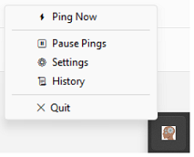
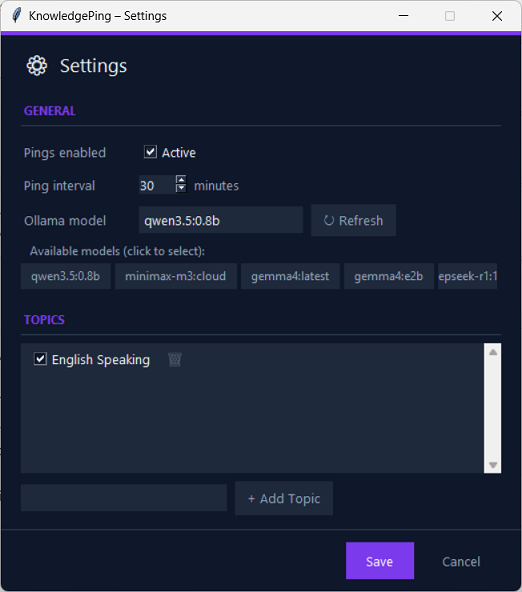

# KnowledgePing

Lightweight background learning agent that delivers AI-generated micro-lessons
and quizzes at scheduled intervals.
After launch, KnowledgePing hides itself to the **system tray**.




| Tray menu item  | Action                                |
|-----------------|---------------------------------------|
| Ping Now        | Trigger an immediate lesson or quiz   |
| Pause / Resume  | Temporarily disable scheduled pings   |
| Settings        | Change model, interval, manage topics |
| History         | Browse past lessons and quizzes       |
| Quit            | Exit the application                  |

### Popup types

**Lesson** — A 4-6 sentence explanation of a topic.

**Quiz** — A question is shown; click **Reveal Answer** to see the answer.

---

## Requirements

- Python 3.10+
- [Ollama](https://ollama.com) running locally
- A lightweight model pulled, e.g. `gemma3:1b`

---

## Setup

```bash
# 1. Clone / download the project
cd KnowledgePing

# 2. Create a virtual environment
python -m venv .venv
source .venv/bin/activate  # Windows: .venv\Scripts\activate

# 3. Install dependencies
pip install -r requirements.txt

# 4. Make sure Ollama is running and you have a model
ollama serve &
ollama pull gemma3:1b

# 5. Run
python main.py
```

---

## Configuration

All settings are persisted in `data/knowledgeping.db` and editable via the
Settings window:

| Setting            | Default      | Description                             |
|--------------------|--------------|-----------------------------------------|
| Ollama model       | qwen3.5:0.8b | Any model available in your Ollama      |
| Ping interval      | 30 min       | How often a popup appears (1–240 min)   |
| Pings enabled      | Yes          | Toggle from tray or settings            |
| Topics             | 1 seed       | Add / remove / toggle individual topics |

